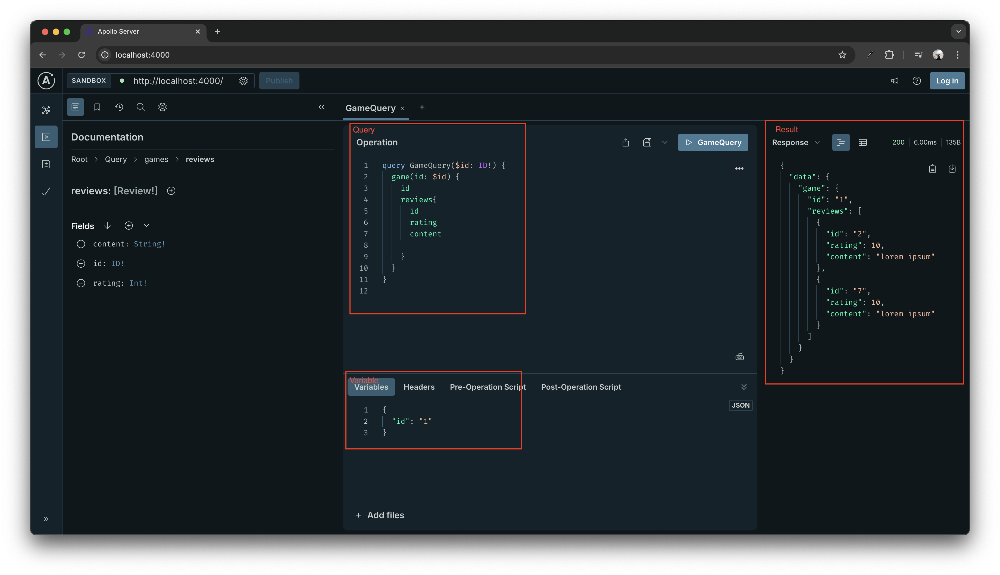

This folder contains a learning example of GraphQL resolver.

And this example is based on the YouTube Video: [GraphQL Crash Course #5 - Resolver Functions](https://www.youtube.com/watch?v=mjqfYgFyziU) .


# Commands

1. Prepare project environment and dependencies

    ```bash
    npm init
    npm install --verbose
    ```

2. Start the server

    ```bash
    node index.js
    ```

# Queries
 
1. Query with an argument

    ``` GraphQL
    # Query
    query GameQuery($id: ID!) {
        game(id: $id) {
            id
            reviews{
                id
                rating
                content
            }
        }
    }


    # Variable
    {
        "id": "1"
    }
    ```

    